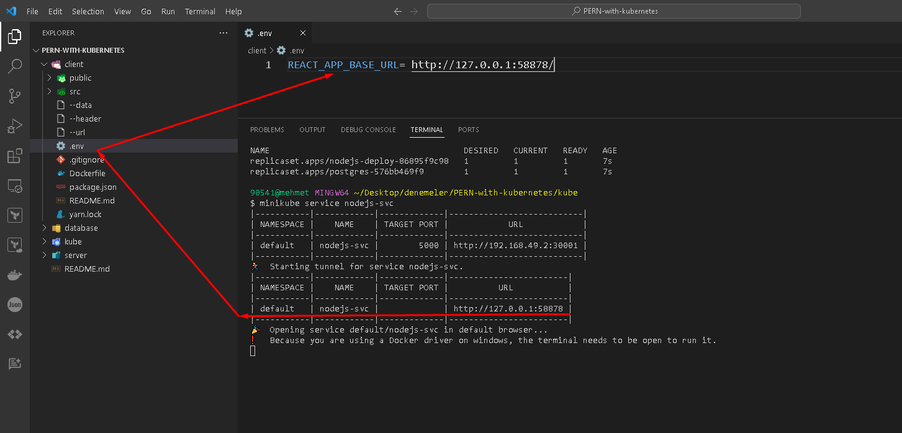

cat os-release: Bu komut, Linux işletim sisteminin sürüm bilgilerini içeren os-release dosyasını konsol ekranında gösterir.

ip a veya ifconfig: Ağ arayüzlerinin IP adreslerini ve diğer ağ konfigürasyon bilgilerini gösterir.

cat /etc/resolv.conf: Bu komut, DNS (Domain Name System) yapılandırma bilgilerini içeren resolv.conf dosyasının içeriğini gösterir.

route -n veya ip route: Bu komut, sistemdeki yönlendirme tablosunu gösterir. IP paketlerinin hangi ağ arabiriminden nereye yönlendirileceğini belirtir.

arp: Ağ ARP (Address Resolution Protocol) önbelleğini gösterir, yani IP adreslerini fiziksel MAC (Media Access Control) adreslerine eşler.

curl --request POST \
--url 'http://<nodejs-ip:nodeport>/todos' \
--header 'content-type: application/json' \
--data '{"description":"ansible project 207"}'

.env
REACT_APP_BASE_URL= http://<NODEJS_IP:NODEPORT>/

minikube ile calistiriken
